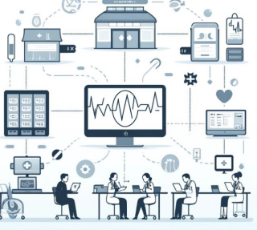

# Computer-Networks-in-Hospital-Management-System

## Table of Contents

1. Introduction to Hospital Networks  
2. Importance of High-Speed Internet in Hospitals  
3. Network Topologies Used in Hospitals  
4. Devices Used for Hospital Networking  
5. Managing Large-Scale Hospital Network Infrastructure  
6. Security and Access Control in Hospital Networks  
7. Role of Servers and Data Centers in Hospitals  
8. Cloud Computing and Virtualization in Hospital Networks  
9. Network Maintenance and Troubleshooting Strategies  
10. Future Trends in Hospital Networking  

Hospital networks facilitate communication, data sharing, and patient care by providing a structured system for hospitals to manage their digital operations. High-speed internet is crucial for real-time patient monitoring, telemedicine, and electronic health records, ensuring seamless medical services. Different network topologies, such as star, mesh, and hybrid, are used to optimize connectivity and efficiency within hospitals. Various networking devices, including routers, switches, and access points, play a key role in maintaining smooth hospital operations.  

Managing large-scale hospital network infrastructure involves handling bandwidth, redundancy, and scalability to support critical medical functions. Security and access control measures, such as firewalls, encryption, and role-based access, protect sensitive patient data and ensure compliance with regulations. Servers and data centers store and process vast amounts of medical records, ensuring quick access to critical information. Cloud computing and virtualization help hospitals improve data storage, accessibility, and scalability while reducing operational costs.  

Network maintenance and troubleshooting strategies ensure the reliability and efficiency of hospital networks, preventing downtime that could impact patient care. Future trends in hospital networking include AI-driven network management, 5G integration, and blockchain for secure medical data exchange, driving innovation and efficiency in healthcare IT.

